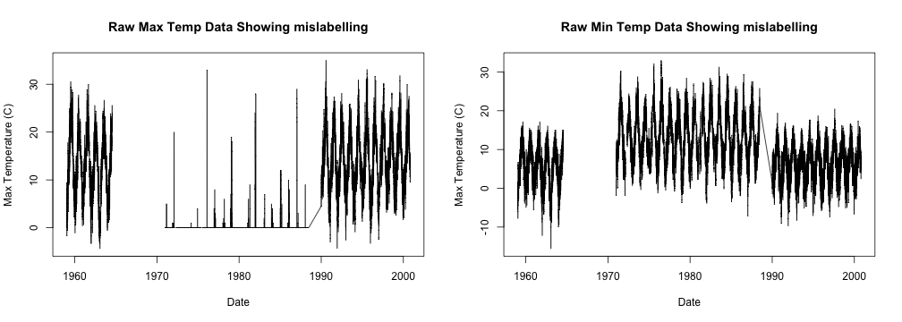
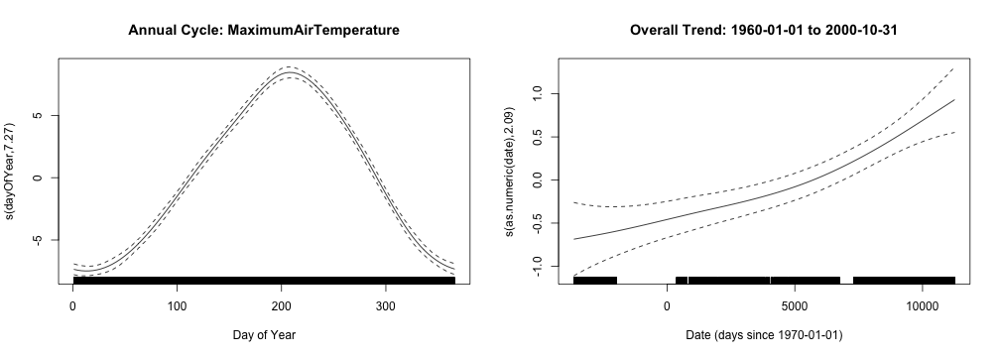
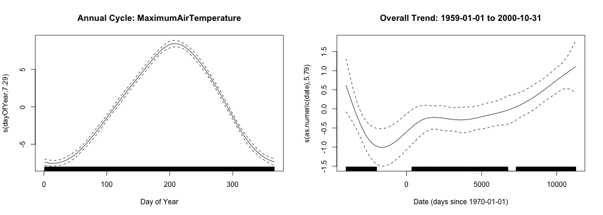

## Introduction

In thinking about global warming, people often remark that they feel that weather patterns are indeed changing based on individual, local observation.

I have access to approximately 40 years of meteorological data collected during 1959-2000 (approximately) from an amateur weather station in English Midlands to which I once contributed.  (The station now sadly is closed.)

The real purpose was to build an application that could be used to explore the data set.  But can any trends in temperature be identified?

--- .class #id 

## Messy Data

One important thing learned from the Data Science Specialization -- even the simplest data set can contain surprises and needs to be examined! Here some maximum temperature data is actually snowfall, and some minimum temperature data is actually maximum temperature. Subsequent analysis is based on a corrected data set.

 

--- .class #id 

## A Selective View of Temperature Trends

If we look at Max temp from 1960-2000, it *appears* there is a clear trend of increasing temperature, with an overall increase of about 1.5 degrees celsius.  But does this trend consistently appear?

 

--- .class #id 

## Changing the perspective

However, extending the time window back one year to include 1959 muddies the picture.  It turns out that 1959 had a memorably warm summer. With the new model, it is no longer clear that temperatures in the late 1990's were any warmer than those seen 40 years earlier.

While this was a only a brief example, it still appears dangerous to use this data set to prove a clear trend of increasing temperature, or at the least a more sophisticated analysis is required.

 

